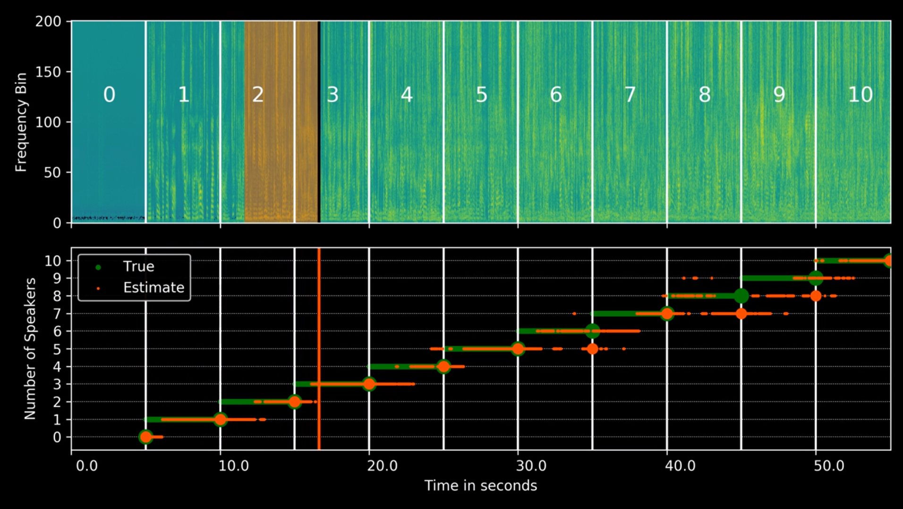
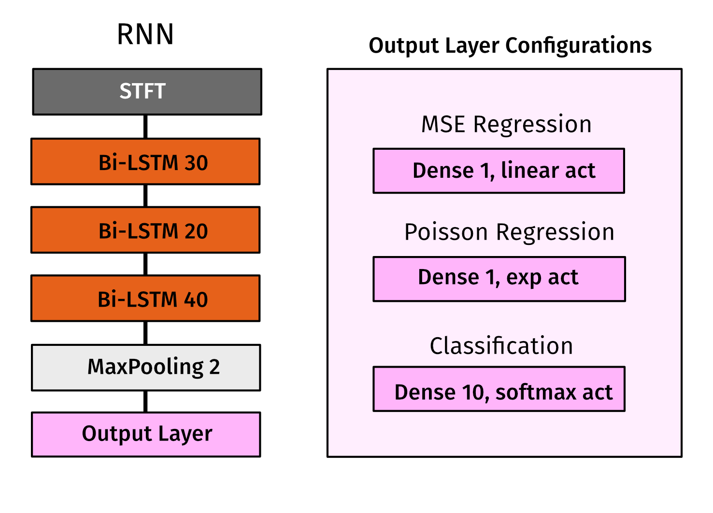
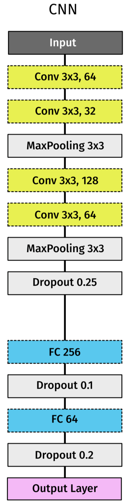

# Concurrent Speakers Counter
Estimate the number of concurrent speakers from single channel mixtures to crack the "cocktail-party” problem which is based on a Bidirectional Long Short-Term Memory (BLSTM) which takes into account a past and future temporal context.<br><br>



## 1. The model of the paper
Layer |  Layer Name | Input Shape | Output Shape 
:-: | :-: | :-: | :-: 
the First Layer  | BLSTM_1 | (?, 500, 201) | (?, 500, 60) 
the Second Layer | BLSTM_2 | (?, 500, 60)  | (?, 500, 40) 
the Third Layer  | BLSTM_3 | (?, 500, 40)  | (?, 500, 80)
the Fourth Layer | maxpooling1d | (?, 500, 80) | (?, 250, 80) 
the Fifth Layer | flatten | (?, 250, 80) | (?, 20000) 
the Sixth Layer | dense | (?, 20000) | (?, 11) 
the Seventh Layer | activation | (?, 11) | (?, 11) 

"?" represents the number of samples.<br> 




## 2. My Model
<div align="left">

</div>


## 3. Dependency Library
* [librosa](https://librosa.github.io/)
* [soundfile](https://pysoundfile.readthedocs.io)
* Keras (my test version: 2.1.1)
* Tensorflow (my test version: 1.4.0)
* Anaconda3 (Contains Python3.5+)

## 4. Dataset
It is called [LibriCount10 0dB Dataset](https://zenodo.org/record/1216072#.WyS9AoozaUk).
* contains a simulated cocktail party environment of [0..10] speakers
* mixed with 0dB SNR
* 5 seconds of recording
* 16bits, 16kHz, mono
* 11440 Samples, 832.5 MB

The annotation provides information about the speakers sex, their unique speaker_id, and vocal activity within the mixture recording in samples. The format of json file (3 speakers) is as follows:
```
[
    {
        "sex": "F",
        "activity": [[0, 51076], [51396, 55400], [56681, 80000]], 
        "speaker_id": 1221
    },
    {
        "sex": "F",
        "activity": [[0, 51877], [56201, 80000]],
        "speaker_id": 3570
    },
    {
        "sex": "M",
        "activity": [[0, 15681], [16161, 68213], [73498, 80000]], 
        "speaker_id": 5105
    }
]
```

## 5. Reference Paper
As we all know, it's pretty hard to solve the cocktail-party problem. This is **the first study on data-driven speaker count estimation** and the first step to crack the problem. *Thanks for the author's paper[Paper 2] and code which help me a lot. Their homepage is [AudioLabs Erlangen CountNet](https://www.audiolabs-erlangen.de/resources/2017-CountNet).*
* __Paper 1__: Simon Leglaive, Romain Hennequin and Roland Badeau. Singing voice detection with deep recurrent neural networks (ICASSP 2015).
* __Paper 2__: Fabian-Robert Stöter, Soumitro Chakrabarty, Bernd Edler and Emanuël A. P. Habets. Classification vs. Regression in Supervised Learning for Single Channel
 Speaker Count Estimation (ICASSP2018).
 
## 6. Follow-up Work
I will work on speech separation for a long time. You can fork this repository if interested and pay close attention to my recent study.
