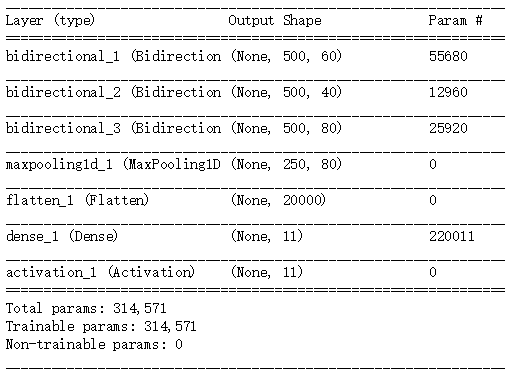

# Concurrent Speakers Counter
Estimate the number of concurrent speakers from single channel mixtures to crack the "cocktail-party” problem. The project is based on a Bidirectional Long Short-Term Memory (BLSTM) Recurrent Neural Network (RNN) which takes into account a past and future temporal context. 

## Model Summary
Layer |  Layer Name | Input Shape | Output Shape 
:-: | :-: | :-: | :-: 
the First Layer  | BLSTM_1 | (?, 500, 201) | (?, 500, 60) 
the Second Layer | BLSTM_2 | (?, 500, 60)  | (?, 500, 40) 
the Third Layer  | BLSTM_3 | (?, 500, 40)  | (?, 500, 80)
the Fourth Layer | maxpooling1d | (?, 500, 80) | (?, 250, 80) 
the Fifth Layer | flatten | (?, 250, 80) | (?, 20000) 
the Sixth Layer | dense | (?, 20000) | (?, 11) 
the Seventh Layer | activation | (?, 11) | (?, 11) 

"?" represents the number of samples.  

## Model Show
<figure class="half">
    
    
</figure>

## Reference Paper & Code
As we all know, it is pretty hard to solve the cocktail-party problem. This is ***the first study on data-driven speaker count estimation*** and the first step to crack the problem. Thanks for the author's paper and code and it helps me a lot.
* __Accepted__: ICASSP2018, Apr 15, 2018 – Apr 20, 2018 in Calgary, Canada
* __Title__: Classification vs. Regression in Supervised Learning for Single Channel
 Speaker Count Estimation
* __Authors__: Fabian-Robert Stöter, Soumitro Chakrabarty, Bernd Edler, Emanuël
 A. P. Habets
* __Code__: [CountNet](https://github.com/faroit/CountNet)
